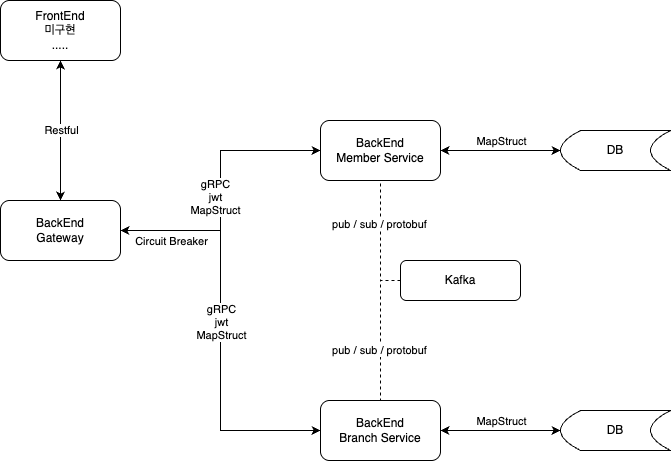

# Crossfit 서비스

### 기본
- Java 21
- Spring Boot
- Kafka
- H2
- gRPC
- JWT
- MapStruct
- vavr

### MSA 형태로 구현
- Gateway
  - 요청을 받아서 각 서비스에게 처리 요청 및 집계 처리
  - https://github.com/pranludi/crossfit-gateway
- Member
  - 회원 가입, 조회 처리, ...
  - https://github.com/pranludi/crossfit-member
- Branch
  - 지점 가입, 조회 처리, ...
  - https://github.com/pranludi/crossfit-branch

### 대략 구성

### todo ...
- protobuf 파일 submodule(repository)
- local, qa, prod 환경 구분 및 DB 분리
- grpc response 구조 변경( circuit breaker 대응 용 )
- 테스트 추가
- docker 기반으로 테스트 할 수 있도록 docker compose 구성
- docker 에서 발생하는 로그 수집 및 kafka 으로 전달하도록 구성 
- member 와 branch 의 로직 추가 ?
- board 게시판 서비스 추가 ?
- kafka stream 을 이용해서 실시간 로그 분석 ?
- elasticsearch(opensearch) / kibana ?

